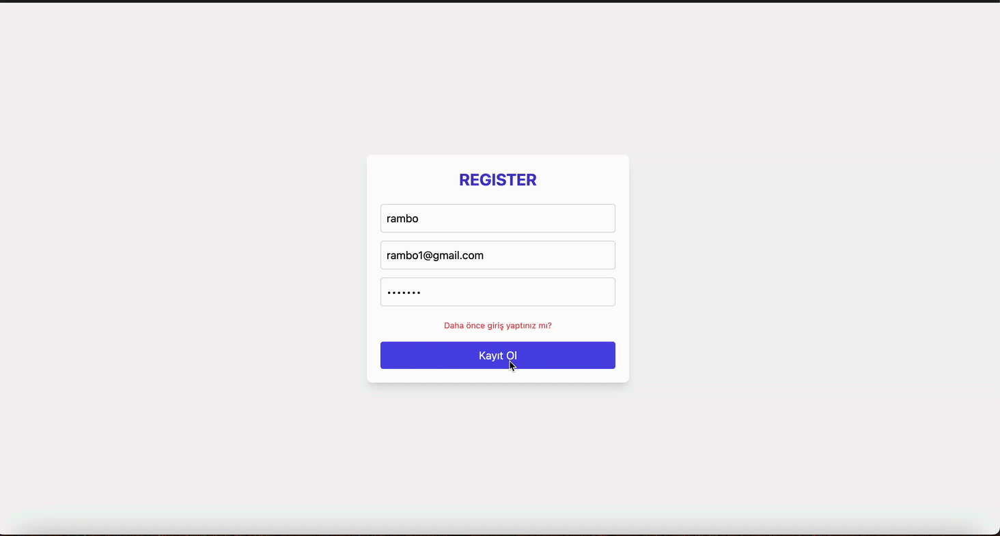

<h1> Mern Stack Project</h1>

This project is a full-stack application that features responsive design and CRUD operations. Users can manage their todo lists by logging in through the login page.

Features:

Authentication: User authentication processes.
Todo Management: Add, update, and delete todos.
Post Sharing: Interaction with shared posts.
Redux: Central management of application state.
Modal Usage: Modals that enhance user experience.
The project includes both front-end and back-end components, and it works effectively on all devices.

<h2> Technologies Used</h2>

- Mongo DB

- Express Js

- React

- Node Js

- Tailwind

- JWT

<h2> Screen Shot</h2>

# mern_stack_todo
